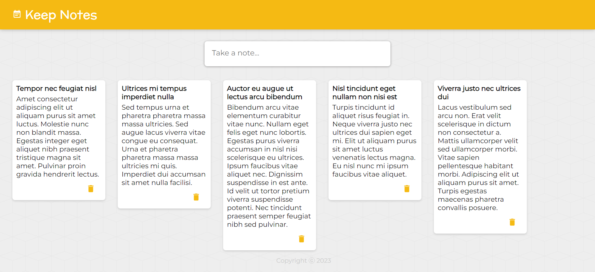

# Keep Notes

The Keep Notes is a user-friendly and intuitive note-taking application built using HTML, CSS, React, and Material-UI. It allows users to create and manage their notes in a convenient and organized manner. With an intuitive interface and powerful features, it provides an efficient solution for users to capture and keep track of their thoughts, ideas, reminders, and more.

## Features

This website has the following features:

* **Intuitive User Interface:** The user interface is designed to be intuitive and user-friendly. With a clean and organized layout, users can easily navigate through their notes and access the various features.
* **Notes Creation:** Users can easily create new notes by providing a title and description for each note. This feature enables quick note-taking, allowing users to capture their ideas without any hassle.
* **Notes Deletion:** Users have the ability to delete unwanted or outdated notes. This feature helps in decluttering the note collection, keeping it organized and focused on the most relevant information.
* More features are coming soon...

## Technologies Used

This website is built using the following technologies:

* **HTML:** The app's structure and layout are defined using HTML (Hypertext Markup Language), the standard markup language for creating web pages.
* **CSS:** Cascading Style Sheets (CSS) are used to enhance the visual appearance and styling of the app. CSS provides customization options for fonts, colors, layouts, and more.
* **React:** The app is developed using React, a popular JavaScript library for building user interfaces. React allows for efficient component-based development, making it easier to manage and update the app's UI.
* **Material-UI:** The web app uses a widely-used React UI component library, called Material-UI that offers a collection of pre-designed, customizable components following the material design principles. It provides a modern and visually pleasing interface for the Keep Notes.

These technologies work together to create a seamless and responsive web application, providing users with an efficient and user-friendly task management experience.

## 🛠 Installation and Setup Instructions

1. git clone https://github.com/tawfik575/keep-notes.git
2. cd keep-notes
3. npm install
4. npm start

## Contributing

Contributions to this web application are welcome! If you find a bug or have an idea for an improvement, please submit an issue or create a pull request. Make sure to follow the existing code style and provide detailed information about your changes.

## License

This project is licensed under the MIT License. Feel free to use, modify, and distribute the code as per the terms of the license.

## Contact

If you have any questions, suggestions, or feedback about the project, feel free to contact me at `tawfikbsmrstucse@gmail.com`.
